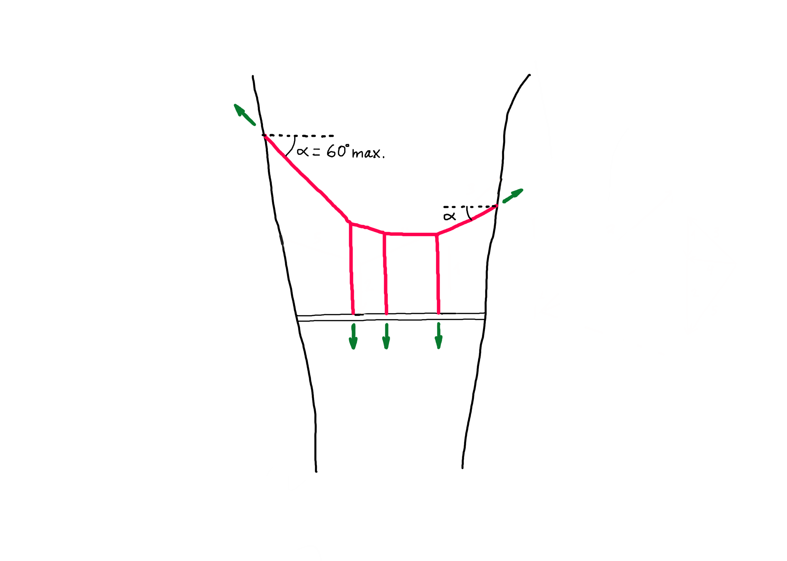

# Exercise B-2


Complete the exercises below and submit the files **by 9:45 am on Friday, November 1st.**

File 1: Rhinoceros file

File 2: Grasshopper file (only one file for all tasks!)

File 3: PDF of the word document file with answers

Please follow the file naming convention as shown in the [**Syllabus**](../../syllabus.md#submissions).

[**Submit here**](https://moodle-app2.let.ethz.ch/course/view.php?id=23670)



Use the Rhinoceros and Grasshopper files from the tutorial as a base to solve the tasks. Then, answer the questions in the docx file. You will find all these files [**here**](./).


### Task 0 - Flow chart

Draw a simple flowchart of the algorithm from Tutorial 2.&#x20;

A flowchart is a step-by-step approach until you find the answer. Flowcharts help you to visualize the processes in small steps and they are very similar to how the computer executes your instructions.

|   Function   |        Shape       |                                   Explanation                                   |
| :----------: | :----------------: | :-----------------------------------------------------------------------------: |
|   Start/End  | rounded rectangles | Start is required of all flowcharts, while some flowcharts may not have an end. |
|    Process   |      rectangle     |               It involves the action, to do something. e.g. add 1               |
| Input/Output |    parallelogram   |      It indicates that manual operation is needed. e.g. type in the number      |
|   Decision   |       rhombus      |                        e.g. Is the number bigger than 10?                       |
|     Arrow    |        arrow       |                       It indicates the flow of the chart.                       |

#### Example:

In this algorithm, we want to calculate the material cost of a gridshell made from bar elements. The bar elements that have a length larger than 3 meters have a different cost than those shorter than 3 meters. The algorithm picks a bar, checks its length and stores the data in the corresponding list (small or large). It does the same for all the rest of bars. As a result we know how many short and long elements there are and therefore we can calculate the cost.

### Task 1 - Additional load

In the tutorial we created a parametric model, which, using graphic statics, finds the form of a funicular structure supporting a bridge deck. In this first model, we considered two loads representing the self-weight of the bridge. This task consists of adding a third load on the bridge deck.


Before adding the anchor point of the third load, pay attention first to how the loads are ordered along the bridge deck in the tutorial.


### Task 2 - Change of rise

In the tutorial we showed how to change the rise of the funicular structure modifying the geometry of the form diagram. Find now a way to achieve the same thing this time by modifying the geometry of the force diagram.


You can use the initial Grasshopper file to solve this task. However, if you use the Grasshopper definition with three loads you created in Task 1 as a base you will get more interesting results.


### Task 3 - Tributary areas

In the algorithm shown in the tutorial, the magnitude of the loads is defined with a number slider. And this value is valid no matter where along the bridge deck the loads are located. Find out how the magnitude of the loads can respond to the tributary areas, so that each cable supports its respective part of the bridge deck. Consider a design area load including both the self weight and the live loads of 4kN/m2. The bridge is 13.75m long and 0.8m wide.


You can use the initial Grasshopper file to solve this task. However, if you use the Grasshopper definition that includes Tasks 1 and 2 you will get more interesting results.


### Task 4 - Constrained force diagram

The funicular cable system will serve to support the bridge deck, but it will also be used as a lightweight bridge, along its curved shape, for a via ferrata as shown in the reference picture below.

To design your "Stairway to Heaven", apply the following constraints:

1. The angle of the steepest sections must not exceed 60 degrees in relation to the horizontal (see sketch below).
2. The funicular must work fully in tension.


You can use the initial Grasshopper file to solve this task. However, if you use the Grasshopper definition that includes Task 1 you will get more interesting results.


### Task 5 - Design exploration

Design two bridge structures and explain why you find these interesting. Finally, find the form a third rare structure in equilibrium. There are some families of solutions which lead to very strange result in equilibrium. Will you find them?


Take into account that the largest design space is in the model that includes Tasks 1, 2 and 3.

