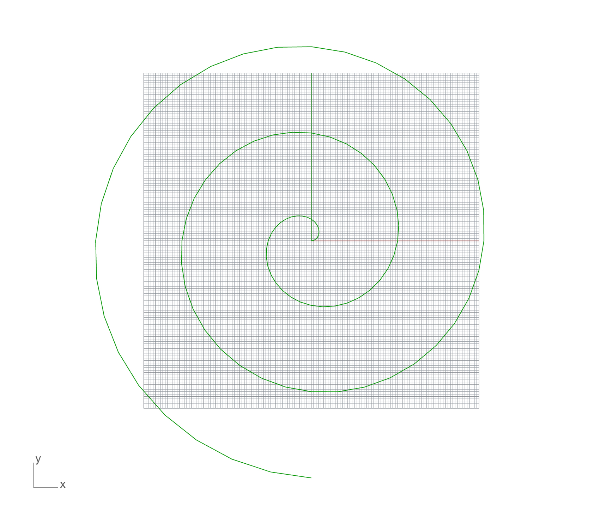
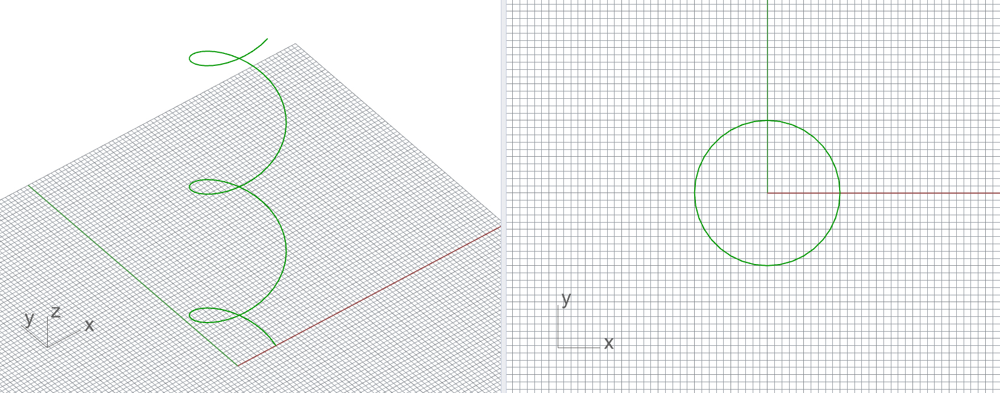

# Exercise C-1


Complete the tasks below and submit the files **by 9:45 am on Friday, November 8th.**

File 1: Rhinoceros file

File 2: Grasshopper file (only one file for all tasks!)

Please follow the file naming convention as shown in the [**Syllabus**](../../syllabus.md#submissions).

[**Submit here**](https://moodle-app2.let.ethz.ch/course/view.php?id=23670)



This exercise is meant for you to practice Python programming. These tasks can be solved in multiple ways, so there is not a single valid solution.


### Task 1 - Loop

Create an algorithm using a "for loop" that generates the following list L1= \[0,7, 14, 21, 28, 35, 42, 49, 56, 63, 70].

### Task 2 - Loop

Now create a second list L2 that adds +3 to every item of L1.

### Task 3 - Conditional

Given the list L1=\[0,7, 14, 21, 28, 35, 42, 49, 56, 63, 70], **if** the length of the list is equal or larger than 11 then print "True", otherwise print "False".

### Task 4 - Loop and conditional

Given the following list L1=\[\[5,3],\[0,3],\[0,7],\[6,-6],\[10,-3],\[11,8],\[6,0],\[1,1]], create a new list (L2) only with the lists from L1 whose items add up to 7 or more than 7. For example: item "\[5,3]", 5+3 >= 7, so this list is good!


Use the sum() function to add all the items from a list. For example:

L=\[3,4,-4]

print sum (L)

Output: 3


### Task 5 - Geometry

Create an algorithm that draws a spiral in 2D as shown in the image below:

<figure><figcaption></figcaption></figure>

## Additional (non-mandatory) tasks:

### Task 6 - Loop and conditional

Given the following list L1=\[\[3,4],\[5,3,4,5,1],\[0,3,-2,3],\[0,7],\[6,-6,1],\[10,-3],\[11],\[6,0,5,6],\[1,1,3],\[0,8]], create a new list (L2) only with the lists from L1 that have 3 or more items.

### Task 7 - Loop and conditional

Given the following list L1=\[\[3,4],\[5,3,4,5,1],\[0,3,-2,3],\[0,7],\[6,-6,1],\[10,-3],\[11],\[6,0,5,6],\[1,1,3],\[0,8]], create **inside of one single loop**:

* a new list (L2) only with the lists from L1 that have 3 or more items.
* a new list (L3) only with the lists from L1 that have 3 or more items and whose items add up to 5 or more.
* a new list (L4) only with the lists from L1 that have 3 or more items and whose items add up to less than 5.

### Task 8 - Geometry

Create an algorithm that draws a 3D helicoidal curve as the one shown in the mage below.

<figure><figcaption></figcaption></figure>

### Task 9 - Loop and conditional

The two lists below, L1 and L2, store the x and y position of points in the xy plane.

L1=\[\[0,1],\[9,7],\[10,0],\[-1,-1],\[2,2],\[0,10],\[0,2],\[-2,2],\[-10,0],\[-2,-2],\[0,-10],\[2,-2],\[10,0],\[7,7],\[8,8],\[0,10],\[-8,8],\[1,3],\[-10,0],\[-8,-8],\[0,-10],\[3,3],\[8,-8],\[1,1],\[10,0]]

L2=\[\[-3,1],\[3,4],\[10,0],\[-1,1],\[2,2],\[0,10],\[-3,4],\[-2,2],\[-10,0],\[-2,-2],\[0,-10],\[2,-2],\[10,0],\[7,-7],\[8,8],\[0,10],\[-8,8],\[-1,4],\[-10,0],\[-8,-8],\[0,-10],\[3,-3],\[8,-8],\[1,2],\[10,0]]

First, store in a third list L3 only the items **if** they are equal. For example, check the first item in L1, \[0,1], and then check the first item in L2,\[-3,1], are they equal?...no, then do not store this item. Now compare the second item from the first list and the second item from the second list and so on. If the items are equal, then store it once (not two times) in L3.

Second, create a point in every location stored in L3.

Finally, create a polyline connecting the points in L3...what figure emerges?

### Task 10 - Fibonacci

Create an algorithm that generates the Fibonacci sequence: L=\[0, 1, 1, 2, 3, 5, 8, 13, 21, 34, 55, 89, 144, 233, 377, 610, 987, 1597, 2584, 4181, 6765, 10946]. Generate it from scratch, meaning from an empty list.
