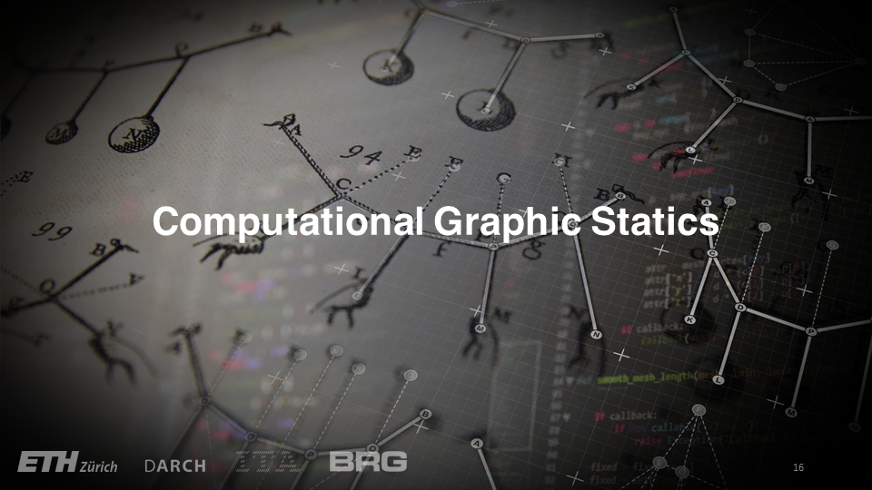

# Lecture

<figure><figcaption></figcaption></figure>

In this lecture, the following topics are presented:

* History of and evolution of graphic statics applications
* New structural design opportunities thanks to computational graphic statics


You will find the lecture pdf [**here**](./)**.**

