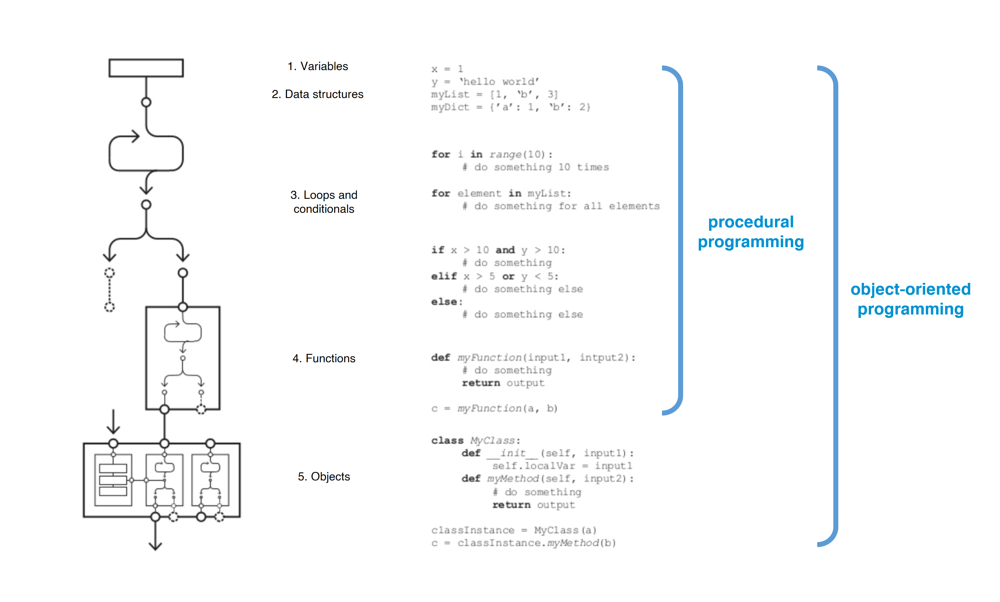

# Tutorial 1

## Learning Goals

In this Python tutorial, you will learn to:

* understand primary variables used in programming.&#x20;
* work with lists as a fundamental data structure.
* explore flow control to direct code execution.
* become familiar with functions in the rhinoscriptsyntax library.

## Python

Python is one of the most popular programming languages today. In this course, we’ll use Grasshopper Python to code directly within Grasshopper, enabling us to visualize results in Rhinoceros. This tutorial covers the fundamental aspects of procedural programming in Python: variables, data structures, and flow control. We’ll also explore basic functions in the rhinoscriptsyntax library.


<figure><figcaption></figcaption></figure>

In procedural programming, a program is organized into procedures that are executed sequentially. This means that the program's execution follows a linear path, where each statement or instruction is executed one after the other in the order in which they appear in the code.

### 1. Variables

Variables are containers of data values. In this tutorial we are going to see only the most common variable types: **strings**, which are text, and **numbers**, which can either be integers or decimals (floats). Let's look at an example of these:

```python
#Strings
a = "hello"
print a
```

```
hello
```

```python
#Numbers
a = 3
b = 5
print a + b

```

```
8
```

### 2. Data structures

In Python, data structures are specialized formats for organizing and storing data. This tutorial will cover only the most commonly used data structure: the list.


In this tutorial the only type of data structure we will learn are lists. However, if you are interested in learning more about data structures, check tuples, sets and dictionaries.


Lists have the following characteristics:

* Ordered collection of elements. Elements are indexed by integers starting from 0.
* Elements are accessed by their index using integers (e.g., `my_list[0]`).
* Mutable. You can modify, add, or remove elements in a list.
* Created using square brackets `[ ]`. Elements are separated by commas.

Below you will find the implementation of lists showing the most basic features:

```python
#creating a list with four items and "printing" it
L_1 = [5,9, 4, 1]
print L_1
```

```
[5, 9, 4, 1]
```

```python
#print the first item in the list
L_1 = [5,9, 4, 1]
print L_1[0]
```

```
5
```

```python
#print the last item in the list
L_1 = [5,9, 4, 1]
print L_1[-1]
```

```
1
```

```python
#add one more item at the end of the list
L_1 = [5,9, 4, 1]
L_1.append(3)
print L_1
```

```
[5, 9, 4, 1, 3]
```

```python
#add one more item at a specific location in the list
L_1 = [5, 9, 4, 1]
L_1.insert(0, 8)
print L_1
```

```
[8, 5, 9, 4, 1]
```

```python
#remove one specific item from a list
L_1 = [5, 9, 4, 1]
L_1.remove(9)
print L_1
```

```
[5, 4, 1]
```

```python
#check the length of a list
L_1 = [5, 9, 4, 1]
print len(L_1)
```

```
4
```

```python
#reverse list
L_1 = [5, 9, 4, 1]
L_1.reverse()
print L_1
```

```
[1,4,9,5]
```

```python
#sum the items of a list
L_1 = [5, 9, 4, 1]
print sum(L_1)
```

```
19
```

```python
# get the index of one item
L_1 = [5, 9, 4, 1]
print L_1.index(4)
```

```
2
```

```python
#connect two lists
L_1= [3,1,0,7]
L_2= [8,2,0,2]
print L_1 + L_2
```

```
[3, 1, 0, 7, 8, 2, 0, 2]
```

```python
#lists within lists
L_1 = [[5, 3], [3, -1], [7, 6]]
print L_1[0]
print L_1[0][1]
print L_1[1][1]
```

```
[5, 3]
3
-1
```

### 3. Flow control

One crucial aspect of programming is to learn to control the execution flow. In this section we will look at the default execution flow, often referred to as "sequential", and two flow control statements: conditionals and loops.

#### 3.1. Sequential

Sequential execution is the most simple and common structure. In sequential execution the computer executes every single line of code one after another as shown in the example below.

```python
L = []
a = 3
b = 7
c = a+b
L.append(a)
print L
L.append(b)
print L
L.append(c)
print L
```

```
[3]
[3, 7]
[3, 7, 10]
```

#### 3.2 Conditionals

As the name suggests in conditionals we will define a condition. If the condition is met the computer will execute one specific part of the code (if statement). We can also use conditionals to execute one specific part of the code if the condition is met or another part of the code if this condition is not met (if else statement). Moreover, one conditional can also be nested within another. Let's implement one example for each of the most common types of conditionals.

```python
#"if" statement
a = 3
if a>2:
    b = 1
print b     
```

```
1
```

```python
#"if else" statement
a = 3
if a<2:
    b = 1
else:
    b = 3
print b
```

```
3
```

```python
#"elif" statement (when there are more than two possibilities)
a = 0
if a>0:
    b = 1
elif a<0:
    b = 3
elif a == 0:
    b = 10
print b
```

```
10
```

```python
#nested conditionals
a = 3
b = 5
if a>= 3:
    if b == 4:
        print a+b
    else:
        print a-b
```

```
-2
```

#### 3.3 Loops

Loops (often called "for" loops) allow you to execute multiple times a series of instructions. The example below shows the implementation of a common loop structure.

```python
#print 3 times the word "hello"
for i in range (0, 3):
    print "hello"
```

```
hello
hello
hello
```

```python
#print the value of "i" along the loop (you get 5 values starting from 0)
for i in range (0, 5):
    print i
```

```
0
1
2
3
4
```

```python
#And now store in a list the value of "i" along the loop
L = []
for i in range (0, 5):
    L.append(i)
print L
```

```
[0, 1, 2, 3, 4]
```

```python
#print all the items of a list one after another (solution 1)
L = [3, 6, 2, 1]
for i in L:
    print i
```

```
3
6
2
1
```

```python
#print all the items of a list one after another (solution 2)
L = [3, 6, 2, 1]
for i in range (0, len(L)):
    print L[i]
```

```
3
6
2
1
```

```python
#add +2 to each of the numbers of a list and store these in a second list
L_1 = [3, 6, 2, 1]
L_2 = []
for i in range (0, len(L_1)):
    L_2.append(L_1[i]+2)
print L_2
```

```
[5, 8, 4, 3]
```

```python
#loop with an additional variable
L_a = []
a = 1
for i in range (0, 4):
    L_a.append(a)
    a = a*5
print L_a
```

```
[1, 5, 25, 125]
```

```python
#loop with a conditional: separate items from a list in three lists
L = [3, 6, -1, 3, -5, 7, 0, 3, -3, -3, -1,2,1,0]
L_positive = []
L_negative = []
L_zero = []
for i in range (0,len(L)):
    if L[i]>0:
        L_positive.append(L[i])
    elif L[i]<0:
        L_negative.append(L[i])
    elif L[i] =  = 0:
        L_zero.append(L[i])
print L_positive
print L_negative
print L_zero
```

```
[3, 6, 3, 7, 3, 2, 1]
[-1, -5, -3, -3, -1]
[0, 0]
```

### 4. RhinoScriptSyntax

RhinoScriptSyntax is a library of functions that allows us to execute many of the common commands in Rhinoceros. Luckily, this is installed by default in Grasshopper Python. In the example below only the most usual functions are shown. However, feel free to explore other functions by yourself. In this [link](https://developer.rhino3d.com/api/RhinoScriptSyntax/) you can find the complete list of functions.

In order to run one of the functions from the library, we will type "rs." and the name of the function, which we can find in a drop-down list. After selecting the function from the list, we will open a parenthesis and in this moment some information will appear indicating us the sort of data the function needs to work. The example below shows how to run the most common RhinoScriptSyntax functions.

#### 4.1 Creating points, lines and vectors

```python
#RhynoScriptSyntax
import rhinoscriptsyntax as rs
#Create a point
a = rs.AddPoint([10,0,0])
print a
```

```
227d4db7-8d66-4cab-94ed-9460121b88fc
```


This very long code with numbers and letters in the output is the object ID. Python creates new ID everytime you run the code so do not get surprised if you don't get this exact number when you run the code.


```python
#RhynoScriptSyntax
import rhinoscriptsyntax as rs
#Create a line
a = rs.AddPoint([10,0,0])
b = rs.AddPoint([0,10,0])
line = rs.AddLine(a,b)
print line
```

```
870bdfb6-8851-4349-be34-6eea69c9ec2e
```

```python
#RhynoScriptSyntax
import rhinoscriptsyntax as rs
#Create a vector between two points, from point b to point a
a = rs.AddPoint([0,0,0])
b = rs.AddPoint([10,0,0])
vec = rs.VectorCreate(a,b)
print vec
```

```
-10,0,0
```

#### 4.2 Basic point and line functions

```python
#RhynoScriptSyntax
import rhinoscriptsyntax as rs
#Find the coordinates of a point
a = rs.AddPoint([10,0,0])
p_coor = rs.PointCoordinates(a)
print p_coor
```

```
10,0,0
```

```python
#RhynoScriptSyntax
import rhinoscriptsyntax as rs
#Find the length of a curve
a = rs.AddPoint([10,0,0])
b = rs.AddPoint([0,10,0])
line = rs.AddLine(a,b)
line_length = rs.CurveLength(line)
print line_length
```

```
14.1421356237
```

```python
#RhynoScriptSyntax
import rhinoscriptsyntax as rs
# Start and ending point of a curve
a = rs.AddPoint([10,0,0])
b = rs.AddPoint([0,10,0])
line = rs.AddLine(a,b)
line_sp = rs.CurveStartPoint(line)
line_ep = rs.CurveEndPoint(line)
print line_sp
print line_ep
```

```
10,0,0
0,10,0
```

```python
#RhynoScriptSyntax
import rhinoscriptsyntax as rs
#Midpoint of a curve
a = rs.AddPoint([10,0,0])
b = rs.AddPoint([0,10,0])
line = rs.AddLine(a,b)
line_mp = rs.CurveMidPoint(line)
print line_mp
```

```
5,5,0
```

```python
#RhynoScriptSyntax
import rhinoscriptsyntax as rs
#Divide a curve in 4 segments
a = rs.AddPoint([10,0,0])
b = rs.AddPoint([0,10,0])
line = rs.AddLine(a,b)
L_p_line = rs.DivideCurve(line,4)
print L_p_line
print L_p_line[1]
```

```
[<Rhino.Geometry.Point3d object at 0x00000000000003CD [10,0,0]>, <Rhino.Geometry.Point3d object at 0x00000000000003CE [7.5,2.5,0]>, <Rhino.Geometry.Point3d object at 0x00000000000003CF [5,5,0]>, <Rhino.Geometry.Point3d object at 0x00000000000003D0 [2.5,7.5,0]>, <Rhino.Geometry.Point3d object at 0x00000000000003D1 [0,10,0]>]
7.5,2.5,0
```

```python
#RhynoScriptSyntax
import rhinoscriptsyntax as rs
#Intersection between two lines
a = rs.AddPoint([10,0,0])
b = rs.AddPoint([0,10,0])
c = rs.AddPoint([0,0,10])
line1 = rs.AddLine(a,b)
line2 = rs.AddLine(b,c)
p_int = rs.LineLineIntersection(line1,line2)
print p_int
print p_int[0]
```

```
(<Rhino.Geometry.Point3d object at 0x00000000000003D2 [0,10,0]>, <Rhino.Geometry.Point3d object at 0x00000000000003D3 [0,10,0]>)
0,10,0
```

#### 4.3 Basic transformation functions

```python
#RhynoScriptSyntax
import rhinoscriptsyntax as rs
#Move an object along a vector
a = rs.AddPoint([10,0,0])
vec = [5,0,0]
a_mov =  rs.MoveObject(a,vec)
print rs.PointCoordinates(a_mov)
```

```
15,0,0
```

```python
#RhynoScriptSyntax
import rhinoscriptsyntax as rs
#Copy an object
a = rs.AddPoint([10,0,0])
a_copy = rs.CopyObject(a)
print a
print a_copy
```

```
cf7cff22-7a0f-42bc-b1b8-68c8344d7093
3eefe542-e8c7-4870-a8bf-c9aeb2421d1a
```

```python
#RhynoScriptSyntax
import rhinoscriptsyntax as rs
#Copy and move an object along a vector
a = rs.AddPoint([10,0,0])
vec = [8,8,0]
a_copy = rs.CopyObject(a,vec)
print rs.PointCoordinates(a_copy)
```

```
18,8,0
```

```python
#RhynoScriptSyntax
import rhinoscriptsyntax as rs
#Rotate object around an axis
a = rs.AddPoint([10,0,0])
rs.RotateObject(a,[0,0,0],90)
print rs.PointCoordinates(a)
```

```
0,10,0
```

```python
#RhynoScriptSyntax
import rhinoscriptsyntax as rs
#Scale an object
a = rs.AddPoint([1,0,0])
b = rs.AddPoint([0,1,0])
line = rs.AddLine(a,b)
line_sp = rs.CurveStartPoint(line)
line_scale = rs.ScaleObject(line,line_sp,[10,10,10])
print rs.CurveLength(line_scale)
```

```
14.1421356237
```
