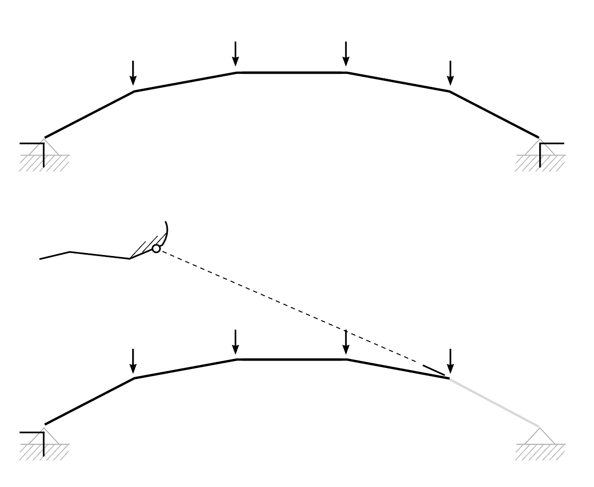

# Exercise D-2


Complete the tasks below and submit the exercise **by 23:45 pm on Friday, December 6th.**

File: PDF of the word document with answers

Please follow the file naming convention as shown in the [**Syllabus**](../../syllabus.md#submissions).

[**Submit here**](https://moodle-app2.let.ethz.ch/course/view.php?id=23670#section-0)


## Task 1: Cantilever arch-cable structure

Here's a comparison between an arch and a cantilever arch-cable under four external loads. If you remove the member on the right and find the intersection between its extension and the anchoring obstacle, you will find the correct anchor point to anchor the cable, and the cable can carry the loads originally in the member (Fig.1).

In task 1, we will design a 15m cantilever arch-cable viewing platform on a vertical cliff.

Assume that:

* The total weight applied to the deck is 50 kN. Assume that the deck is divided into 5 parts such that the load of 10 kN should be applied at each loaded node.
* The supports can be anchored anywhere on the cliff.

The steps to construct the cantilever arch-cable are described as follows (Fig.2).

1. Define two anchor points on the cliff and the direction of the reaction force in the tensile element.
2. Find the support of the arch on the right side.
3. Form find the arch under the self-weight of the deck.
4. Transfer the load on the arch to the upper chord.
5. Rebuild the entire geometry and analyze it again in IGS2 to obtain the final force diagram.

<figure><figcaption>
Fig.2
</figcaption></figure>

* Assume that the load on the structure is no longer uniform. Could the arch-cable cantilever structure take non-uniformly distributed loads? If not, could you propose a modification to stabilize the structure under the following loads (Fig.3)? (Hint: Topological modification is allowed)

<figure><figcaption>
Fig.3
</figcaption></figure>

## Task 2: Design your bridge

In task 2, you will design two proposals for a bridge with a viewing cantilevering platform. The goal is to come up with a proposal that works in terms of both architecture and structure. For this:&#x20;

1. Create hand-made sketches showing the concept of bridge with red-and-blue qualitative force flow (without force diagram).&#x20;
2. Then, solve it with IGS2 and check the forces. If the forces are too large propose a way to optimize the form.&#x20;
3. After, add a stiffening scheme, if required, and load the structure with an asymmetric load.&#x20;

Assume that:

* The weight of the deck is 5 kN/m. The weight should be uniformly distributed along the span. However, you can divide the deck into as many parts as you want.
* You can anchor anywhere on the left cliff and the middle island.
* In your design, the deck does not need to remain horizontal.

Propose two bridge designs:

* In the first design, the bridge and the viewing platform are two independent structures. One of them should be an arch-cable, and the other one should be a truss.
* In the second design, the bridge and the viewing platform must be a single structure. Solve it using arch-cables or a combination of a truss and an arch-cable. After, propose a stiffening scheme and add an asymmetric load of 15 KN.
