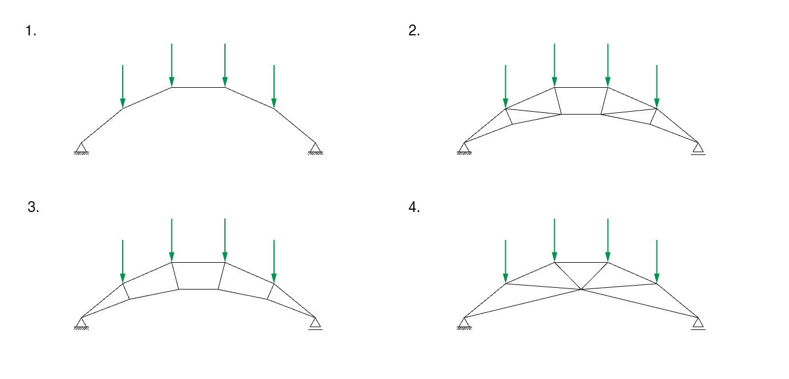

# Exercise D-1


Complete the tasks and submit the files **by 9:45 am on Friday, November 29th.**

File 1: Rhinoceros file for Task 3

File 2: Grasshopper file for Task 3

File 3: PDF of the word document file with answers

The .json files (COMPAS-IGS) are not required.&#x20;

Please follow the file naming convention as shown in the [**Syllabus**](../../syllabus.md#submissions).

[**Submit here**](https://moodle-app2.let.ethz.ch/course/view.php?id=23670)


## Save and load session

In COMPAS toolbar, you can save the working session using button  and load the session using button .png>). Make sure that every time you want to load a session you do it from a new Rhino scene. In other words, you must reboot Rhinoceros for every new file you open.&#x20;

## Task 1: Stability, static determinacy and degree of freedom

In the lecture, we learned to check if a structure is stable or unstable and statically determinate or statically indeterminate. We also learned the concept of the degree of freedom of a structure, which is useful to execute IGS2. Check these concepts for the following four structures.

<figure><figcaption></figcaption></figure>

## Task 2: Analysis of trusses

Analyze the following 3 trusses and complete the questions in the doc file.

Assume that:

* The total weight applied to the deck is 50 kN. They are distributed equally: 10 kN at each loaded node.
* All the trusses have a pin support on the left and a roller support on the right.

Here are the three trusses (Fig-1-1):

1. Truss 1 with N diagonals
2. Truss 2 with V diagonals
3. Truss 3 with K diagonals

## Task 3: Truss algorithm

Using Python, create an algorithm that can rapidly generate different types of trusses to later be analyzed using IGS2. To do this, first, create in Rhinoceros two curves representing the top and bottom cords of the truss. Then, divide these curves to define the number of cells of the truss. After, create the vertical and the diagonals. Finally, create the loads and reactions at the supports. Place the supports at the extremes of the truss. Once this is ready, analyze with IGS2 the cases below to understand how the different parameters influence the force flow.

* 2 trusses with different top and bottom cords but same diagonals
* 2 trusses with different diagonals but same top and bottom cords&#x20;
