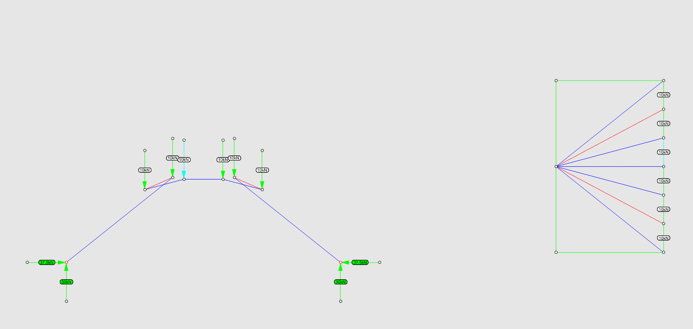
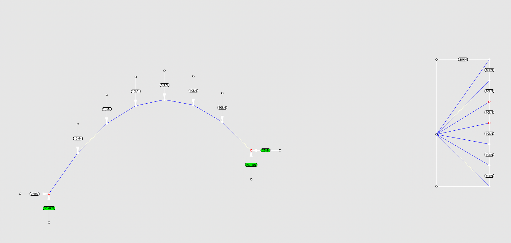

# Tutorial 2

## 1. Analysis and form finding of an arch under uniformly distributed load

In procedure graphic statics, we use the form and force diagrams to find a funicular structure in equilibrium. Here we will use algebraic graphic statics to find an arch under uniformly distributed load (Fig.1). The load in each node is equal to **10 kN**.

In algebraic graph statics, we always need to start from the desired topology, which means the algorithm only works with a given geometry, and you need to make a drawing of your initial guess. The steps are shown in Fig.2. We assume that the two extremities are pin supports. We divide the line between two supports into 7 segments, and the points indicate the line of action of the vertical loads. Here we will use an arc of a circle as an initial guess. Intersect the vertical lines with the arc and redraw the arc as line segments. Hide auxiliary geometries and add lines that represent external forces on the nodes. This is our input geometry for the force diagram.

### 1.1 Analysis of the arch

In this case, we have a funicular arch, but the load is unknown. As long as we know one axial force in our system, we can draw the force diagram with the correct scale. We can double-check this argument via the definition of static determinacy. The system has `m=17` edges and `ni=8` internal nodes. Its `DOF = m - 2*ni = 17 - 2*8 = 1`. We need to assign only one force.

Create FormDiagram with the button  (1) (1) (1) (1) (1) (1) (1) (1) (2) (2).png>)`Crerate Form Diagram` from the lines. Restrain the two extremity vertices assigning them as supports/anchors with the button .png>) `Identify Anchors`. Assign one load, -10 kN, with the button .png>) `Assign Forces`. Press the button  `Create Force Diagram` which generated the ForceDiagram highlighted in Fig.3.

We observe that the force 10 kN is only applied to the edge selected as the independent and the mirrored edge in the form diagram. The rest of the applied loads are different from 10 kN.

### 3.2 Constrained equilibrium under uniformly distributed load

In algebraic graphic statics, modifying a force diagram to update the form diagram sometimes is not as straightforward as you modify it manually.

Four types of constraints are possible in the current version of IGS2 (Fig.4)

1. **Anchor a vertex,** fixing its x and y coordinates;
2. Constraint a vertex to a **line of action**;
3. Constraint **edge direction**; and
4. Apply **target forces** in the form diagram, which reflect in target lengths in the force diagram.

.png>)


Since white is the default color for the constraints, remember to change your background color. Grey is preferred. The visualization of the arch after the default constraints should look as follows:


To achieve the geometry corresponding to the uniformly distributed load from our hypothesis, we will first add default constraints. The default constraint is implicit when we do graphic statics by hand. On the form diagram (Fig.5):

* the vertices in the form diagram with an externally applied load are constrained to remain on the line of action of the load (constraint type 2);
* the leaf-edges (reactions or loads) have their orientation fixed (constraint type 3).

Assign the default constraint by clicking `Assign default constraints` (Fig.6). We wee that:

* Edges in the form and force diagrams with orientation fixed are highlighted in white.
* Vertices in the form and force diagram with line constraints are highlighted in white.
* Anchored vertices are shown in red.

Secondly, we assign **target forces** to the load edges with the same magnitude as the applied load. This reflects as a constraint on the **target length** of the dual edges in the force diagram. To assign these additional constraints click on the button  (1) (1) (1) (1) (1) (1) (1) (1) (2) (2).png>) `Assign edge constraints` and select the option `ForceMagnitude`. Select all applied loads and give the target magnitude (10 kN). The sign +/- is not essential here since it will always take the same sign of the applied load. The target forces will show in white in the form and force diagrams (Fig.7).

Now, we apply constraints to the form and force diagrams which forces them to look for a new equilibrium. Now we can update the form and force diagrams (bi-directional update). Type command `COMPAS_settings`, and check `bi-directional`. If you don't turn bi-directional on and press `Update Both Diagrams`, you will receive an error message.

Now that the bi-directional module is activated, you click on `Update Both Diagrams`. Both diagrams will update, and the result should be as displayed below (Fig.8):

The funicular form for a uniformly distributed load is shallower than the original. The geometry is a parabola instead of an arc of a circle.


The constraints can be turned on and off. In the latter, the original force in the edge is displayed. Additionally in the `Inspect diagrams > ConstraintsTable` a table is called showing all constraints, the current force in the edges, as well as the constraints in the vertices applied.

The constraints can be erased from the form using the command `IGS2_form_constraint_edge_remove`.



If you use insufficient constraints, sometimes you will achieve some solutions in equilibrium but not the solutions you want (Fig.9). However, in most cases, the solver will not converge properly, and you will receive a warning.


<figure><figcaption>
Fig.9
</figcaption></figure>

### 3.3 Updating the support

If the constraints are not erased or are reassigned, more modifications could be done on top of the current design. We will explore two simple ones. In the first modification, we move the right support, and the reaction forces 3m up (Fig.10). Click the button  `Move FormDiagram vertices`, select the 3 nodes at the right support and move them.

We then press the button  (1) (1) (1) (1) (1) (1) (1) (1) (2).png>) `Update Both Diagrams` and both diagrams will be matched according to the constraints and the new support position. The resultant structure is still a funicular for the uniformly distributed load case but with supports in different elevations, which makes the vertical reaction forces unbalanced (Fig.11).

The second modification imposes an additional target force on one of the reaction forces. Here we set the horizontal reaction force to have a magnitude of 25 kN. As a result, the funicular arch changes its height. In the force polygon, the horizontal reaction force has its length decreased. The following image shows the result of this modification (Fig.12).

<figure><figcaption>
Fig.12
</figcaption></figure>
