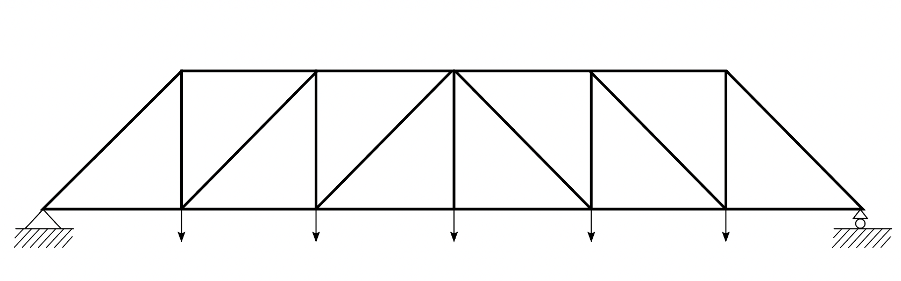
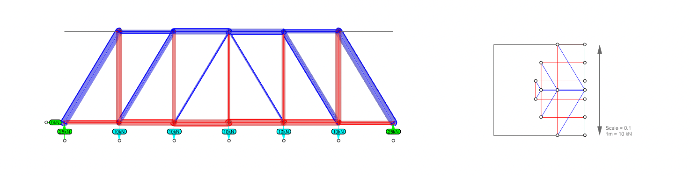

# Tutorial 1

## Content

We have learned how to find a form under variable loads using procedure graphic statics. However, when we want to modify the initial setup of the drawing, such as the number of structural elements and the connectivity, we need to modify a large amount of the program or even reconstruct the entire procedure. This process can be time-consuming and requires profound familiarity with geometric construction knowledge. This week we will use Interactive Graphic Statics (IGS2), a tool based on Algebraic Graphic Statics, to analyze 2-dimensional trusses.

## 1. Analysis of a simple truss

Let's start with the following example of the simple truss. The geometry, loads, and support conditions are depicted in Fig-1-1. The left load is 30 kN, and the right is 10 kN.

### **1.1 Making the form diagram**

In the Rhino file, the lines of this truss are already drawn as Fig-1-2(top-left). The fixed support is represented by two reaction forces in the x and y directions. The roller support is represented by a reaction force in the y direction. Two unsymmetrical external forces are simplified as two lines in the orientation of the forces.

In the toolbar of IGS2, click the button .png>) `Create Form Diagram` and select the option `FromLines`. The FormDiagram will be created as Fig-1-2(top-right). You can notice a difference in the color of the **internal edges** (structure) and **external edges** (loads and reactions). The Form Diagram edges are drawn in the current layer.


The input lines will be hidden from the canvas to avoid overlap with the newly created Form Diagram. If you need to view them again, you need to type the command `Show` in Rhino. The input edges should remain hidden during this tutorial.


Supports should be assigned to the nodes where reaction forces are applied. Click  `Identify Anchors` and select the two nodes in the base of the single panel. These nodes will be highlighted in red(Fig-1-2(bottom-right)).

The system has `m=10` edges and `ni=4` internal nodes. According to the definition of static determinacy, `DOF = m - 2*ni = 10 - 2*4 = 2`. We need to assign two forces. In IGS, you can also click the button  `Check DoF` to check the required number of forces that should be selected. Click  (1) (1) (1) (1) (1) (1) (1) (1) (2).png>) the `Assign Forces` button. Select the two edges representing the loads and apply a magnitude of **-30 kN** to the left load and **-10 kN** to the correct node. For the forces, the negative sign means the force is pressing against the node; the positive sign means pulling away the node. You can identify the left and right edges by the displayed numbers in edge labels. After we hit OK, the forces applied are shown on the edges with an arrow(Fig-1-2(bottom-left)). Verify that the arrow direction corresponds to the desired direction of the applied loads.

After you have assigned the forces, you can click the button  `Check DoF` again to make sure that you have assigned the right number of forces.

### **1.2 Computing the force diagram**

After setting the load, we can compute the equilibrium by calculating the force diagram with the button  (1) (1) (1) (1) (1) (1) (1) (1) (2).png>) `Create Force Diagram`. The force diagram is automatically generated right to the form diagram. The result should be as shown in Fig-1-3.

Note that the reaction forces now also display the value and direction. The default visualization for form and force is the red-blue coloring. **Blue** represents **compression** and **red** represents **tension**. At this point, the scale and location of the force diagram are automatically set by IGS.

In procedure graphic statics, the magnitude of the force is equal to the length of the force diagram. In IGS, the force diagram is automatically scaled based on the size of the form diagram, in case the user accidentally assigns a tremendous axial force. To analyze the magnitude of the forces in specific edges, two options are available in the button  `Inspect Diagrams`. An **EdgesTable** can be displayed with information about all the forces in the structure(Fig-1-4). Additionally, information about one specific edge of the structure can be queried with the option **EdgeInformation** (Fig-1-5).

<figure><figcaption>
Fig-1-4
</figcaption></figure>

For the Form Diagram, pipes can be drawn in the edges with thickness proportional to the load carried (Fig-1-6). The settings can be found in COMPAS toolbar uder the button `Scene Objects`. Choose `Settings` for the FormDiagram and check `show >> forcepipes`.

####

## 2. Analysis of a truss

Here we will look into a warren truss(Fig-2-1). The forces applied at each node have a magnitude of 10 kN.

### **2.1 Making the form diagram**

As in the first example, at the IGS toolbar go to  (1) (1) (1) (1) (1) (1) (1) (1) (2) (3).png>) `Create Form Diagram` and select the option `FromLines` . Use  (1) (1) (1) (1) (1) (1) (1) (1) (2).png>) `Identify Anchors` to select the support nodes. This form diagram is composed of `m=29` edges and `ni=12` internal nodes. Therefore we can specify the force in 5 edges (`DOF = m - 2*ni = 29 - 2*12 = 5`). Use  (1) (1) (1) (1) (1) (1) (1) (1) (2) (2).png>) `Assign Forces` to select 5 forces and input the corresponding force of +**10 kN**. (Fig-2-2) Use .png>)`Check DoF` to verify that you have assigned the right number of forces.

### **2.2. Computing the force diagram**

After setting the load, we can compute the equilibrium by calculating the force diagram using the button  (1) (1) (1) (1) (1) (1) (1) (1) (2) (2).png>) `Create Force Diagram`. The force diagram is automatically generated right to the form diagram. The result should be as below (Fig-2-3).

The sum of external forces are `10 * 5 = 50 kN`. Turn on the hidden Rhino layer `Tutorial >> Guides`, you will find a 5m\*5m box. Now scale the force diagram so that 1m represents 10kN. The scale and location of the diagram can be set using the commands `IGS2_force_move` and `IGS2_force_scale`**.** The scaled force diagram will appear as in Fig-2-4.

### **2.3 Modification of form diagram**

Geometric modifications, such as dragging nodes in the form diagram, can be executed with the button .png>) `Move FormDiagram Nodes`. Once one modification is performed, the force diagram can be updated by pressing the button  `Update ForceDiagram from FormDiagram`.

One example of modification is done below: we move up one of the nodes of the structure. As a result, a large force is attracted to the edge connected to it. This higher magnitude can be seen due to the increased size shown by it in the force diagram (Fig-2-5).

If we increase the height of our truss, the internal forces decrease (Fig-2-6).

<figure><figcaption>
Fig-2-6
</figcaption></figure>

### **2.4 Special case**

The following geometry shows a truss designed by the desired force property under uniformly distributed load (Fig-2-7). It has constant axial forces in the bottom chord. The forces in the diagonal struts are zero. In the force diagram, the endpoints representing these diagonal struts are overlaid, which means the edges are of 0 lengths. Thus, these members can be eliminated from the structure of the chords if the rest elements have sufficient strength and flexural stiffness to satisfy the demand of non-uniform load cases and stability requirements.

Now change the uniform loading to ununiform loading (Fig-2-8). The diagonal struts are no longer of 0 forces.

