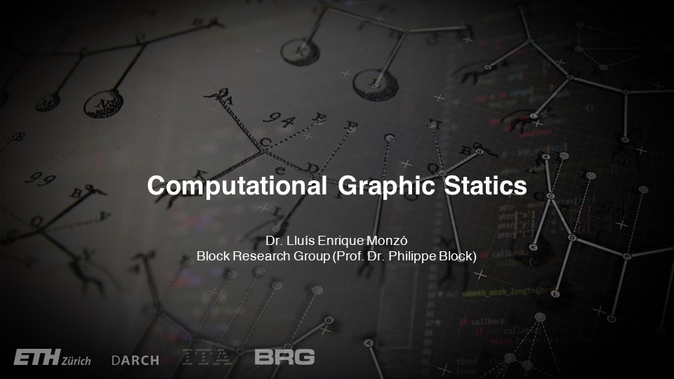

# About

<figure><figcaption></figcaption></figure>

## Welcome to Computational Graphic Statics!

This course explores graphic statics—an intuitive, equilibrium-based method for the form-finding, analysis, and design of structures—through interactive parametric models. By making graphic statics constructions dynamic and manipulable, students can directly explore the relationships between structural geometry, forces, loads, and support conditions.

The course begins with an introduction to algorithmic design thinking and the fundamentals of Grasshopper, followed by the principles of graphic statics and equilibrium. It then introduces computational graphic statics through increasingly complex structural systems, from single-node equilibrium to cables, arches, and combined arch–cable systems. Contemporary research in computational graphic statics provides a broader context for these methods and their ongoing development.

Specifically, students will:

* Develop interactive graphic statics models using Grasshopper.
* Explore structural equilibrium by manipulating geometry, loads, forces, and support conditions.
* Apply graphic statics to the form-finding and analysis of cables, arches, and arch–cable systems.
* Gain an overview of contemporary research and computational approaches in graphic statics.

These concepts will be explored through a series of tutorials and exercises, culminating in an individual investigation using an interactive graphic statics model.

### **General information**

* **Name**: 063-0605-26L : Computational Graphic Statics
* **Semester**: Autumn Semester 2026
* **Lecturer**: Dr. Lluís Enrique Monzó
* **Date/time:** Fridays, 09:45 - 12:30
* **Location**: [HPT](http://www.mapsearch.ethz.ch/map/mapSearchPre.do?gebaeudeMap=HPT\&geschossMap=C\&raumMap=103\&farbcode=c010\&lang=en) [C 103](http://www.rauminfo.ethz.ch/Rauminfo/grundrissplan.gif?gebaeude=HPT\&geschoss=C\&raumNr=103\&lang=en)
* **Language of instruction**: English
* **Periodicity**: yearly recurring
* **Submissions:** You will submit your exercises via the Moodle course page.
* **Comment**: In order to participate in this course, it is recommended that the student has previously taken the courses [Structural Design I and II](https://www.vvz.ethz.ch/Vorlesungsverzeichnis/lerneinheit.view?semkez=2023W\&ansicht=KATALOGDATEN\&lerneinheitId=173845\&lang=en).
