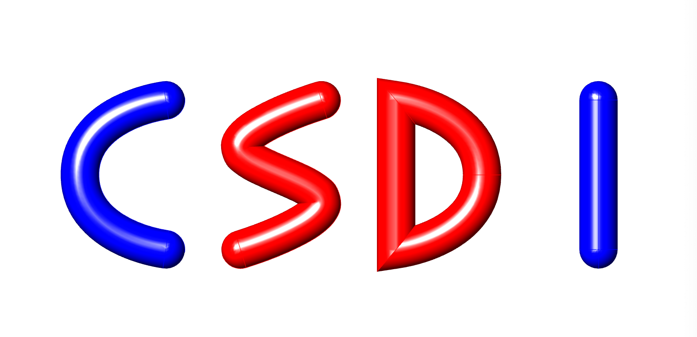
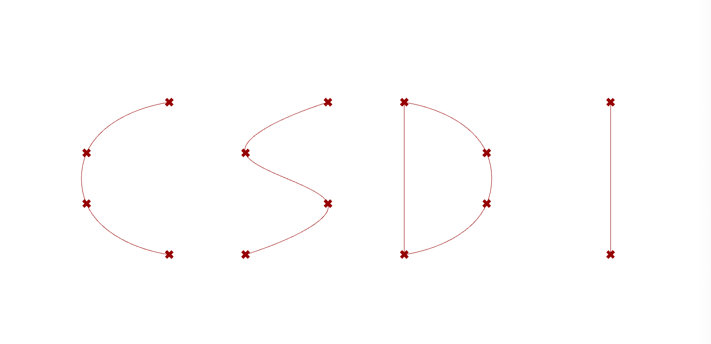
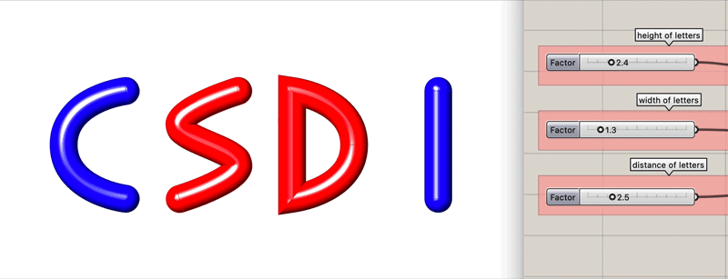
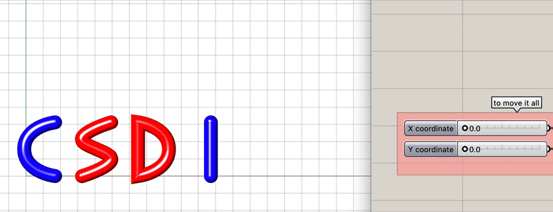
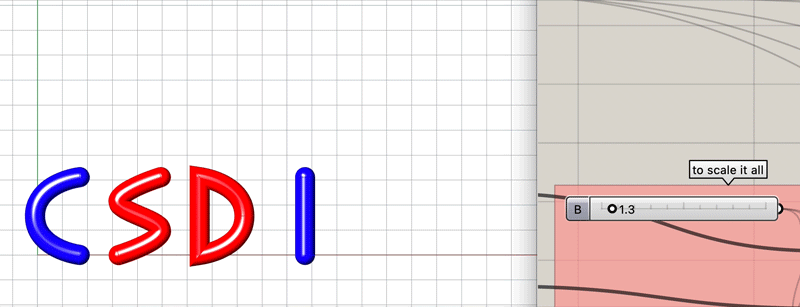
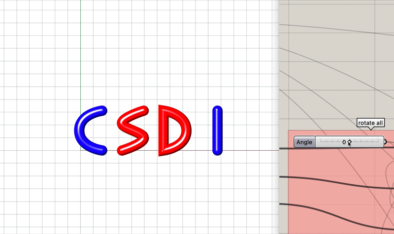

# Exercise


Complete the exercise below and submit the files **by 09:45pm on Friday, Oct 2nd**.

File: Grasshopper file with the solution.

Please follow the file naming convention as shown in the [**Syllabus**](../../syllabus.md#submissions).


### Task Description

To practise your Grasshopper skills and parametric thinking, write your name initials in a parametric manner!

* Use only a single starting point, vectors and lines.
* Build it up in a way that you can change the height, width and distance between letters, and scale it all, move it all, and rotate it all.
* Pipe the letters to make them look balloony and colour them in a colour pattern of your choice (to practise datastructure handling).


These components should be part of your script (possibly amongst others):

* [ ] Slider
* [ ] Panel
* [ ] Construct Point
* [ ] Unit Vectors and/or Vector XYZ
* [ ] Multiplication
* [ ] Division
* [ ] Rotate Vector
* [ ] Move
* [ ] Line and/or Interpolate Curve
* [ ] Merge
* [ ] Entwine
* [ ] ... find a component yourself for the balloony look
* [ ] Weave
* [ ] Colour Swatch
* [ ] Custom Preview

All these components were introduced to you in the tutorial step-by-step so it's a good opportunity to revise the tutorial.


### Example

This is how it looks for the initials "CSDI." In case you're wondering, CSDI were the former initials of this course, standing for "Computational Structural Design I." For your exercise, two letters will be enough.

**1.** This is how your letters should look with auxiliary points of construction and the lines/curves connecting them:

**2.** This is how they should look like as balloons with a colour pattern:

**3.** This is how you should be able to change the height, width and distance of the letters:

**4.** This is how you should be able to change the overall position of it:

**5.** This is how you should be able to change the overall scale of it:

**6.** This is how you should be able to rotate the letters:

